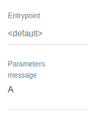
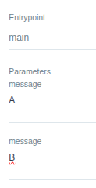
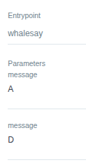

# Resolve parameters

When a parameter is used in a task or template, the value is resolved in the following order of precedence:

- Task/Step-Level arguments: If a parameter is passed to a task/step using arguments, this value takes precedence.
- Template inputs: If no task-level arguments are provided, the value defined in the template's inputs is used.
- Global arguments: If neither task-level arguments nor template inputs provide a value, the global arguments value is used.

Let's see this WorkflowTemplate. It has 2 templates: main (entrypoint) and whalesay

```yaml
apiVersion: argoproj.io/v1alpha1
kind: WorkflowTemplate
metadata:
  name: test-params
spec:
  entrypoint: main
  arguments:
    parameters:
      - name: message
        value: "A" # Third in precedence, if provided and calling the main template
  templates:
    - name: main
      inputs:
        parameters:
          - name: message
            value: "B" # Second in precedence, if provided and calling the main template
      dag:
        tasks:
          - name: whalesay
            template: whalesay
            arguments:
              parameters:
                - name: message
                  value: "C" # First in precedence, if provided and calling the main template
    - name: whalesay
      inputs:
        parameters:
          - name: message
            value: "D" # whalesay param
      container:
        image: docker/whalesay:latest
        command: [cowsay]
        args: ["{{inputs.parameters.message}}"]
```

## Calling the whole tamplate

If we create a workflow calling the whole template without choosing the entrypoint

- the workflow will not have entrypoint
- the printed value will be A



## Calling the main template

If we create a workflow calling the main template

- the entrypoint will be main
- the printed value will be C

The order will be C > B > A



## Calling whalesay

If we we create a workflow calling the whalesay template

- the entrypoint will be whalesay
- D will have preference over A. D will be the value.

The order will be D > A

If both are not provided, the workflow will have an error


