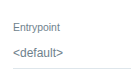

# Ways to call a (cluster)workflowtemplate

## Call the whole template with workflowTemplateRef

We can create a workflow specifying a (cluster)workflowtemplate to be launched using spec.workflowTemplateRef. We can also provider parameters where that they will be passed to the entrypoint.

```yaml
apiVersion: argoproj.io/v1alpha1
kind: Workflow
metadata:
  generateName: myworkflow-
spec:
  workflowTemplateRef:
    name: myclusterworkflowtemplate
    clusterScope: true # this calls a clusterworkflowtemplate. If false or ommited (default), it calls a workflowtemplate
  arguments:
    parameters:
      - name: message
        value: "Hello, world!"
```

No template inside the the (cluster)workflowtemplate is selected. The default one will be used and it will receive the parameters.

In the UI



We cannot use spec.templates if we are using spec.workflowTemplateRef. This throws an error

```txt
Templates is invalid field in spec if workflow referred WorkflowTemplate reference
```

## From a task or step with templateRef

We can invoke a (cluster)workflowtemplate from a task or step defined in a dag or steps template using templateRef.
In this case we must choose what template will be chosen form the (cluster)workflowtemplate as entrypoint.

```yaml
apiVersion: argoproj.io/v1alpha1
kind: Workflow
metadata:
  generateName: myworkflow-
spec:
  entrypoint: main
  templates:
    - name: main
      dag:
        tasks:
          - name: main
            templateRef:
              name: myclusterworkflowtemplate # this calls a clusterworkflowtemplate. If false or ommited (default), it calls a workflowtemplate
              template: whalesay # choose the desired template from the (cluster)workflowtemplate
              clusterScope: true
            arguments:
              parameters:
                - name: message
                  value: "Hello from task"
```

In the UI


## Precedence

A workflow can call a (cluster)workflowTemplate and this (cluster)workflowTemplate can call other (cluster)workflowTemplate(s).

For example:

```txt
Workflow > (cluster)workflowTemplate A > (cluster)workflowTemplate B
```

Argo Workflows handles nested template calls by dynamically expanding and composing templates at runtime.

- When submitting the workflow, Argo workflows resolves (cluster)workflowTemplate A and then (cluster)workflowTemplate B. This continues until all template references are resolved into concrete steps.

- Parameters, volumes, and other configurations cascade down through template calls. So parameters, volumes and other metadatas at higher levels take precedence with lower levels if defined in both. With ServiceAccount, the most specific serviceAccount definition wins

- The result is a single, expanded Workflow object with all steps defined concretely. Once expanded, the final Workflow doesn't change even if source templates are modified

```yaml
# Workflow (highest precedence)
  spec:
    arguments:
      parameters:
      - name: image-tag
        value: "v1.0.0"  # This wins
    workflowTemplateRef:
      name: deploy-template

  # WorkflowTemplate (middle precedence)
  spec:
    arguments:
      parameters:
      - name: image-tag
        value: "latest"   # Overridden by Workflow
      - name: namespace
        value: "staging"  # This wins (not defined in Workflow)
    templates:
    - name: main
      templateRef:
        name: build-template
        template: build

  # WorkflowTemplate 2 (lowest precedence)
  spec:
    arguments:
      parameters:
      - name: image-tag
        value: "dev"      # Overridden
      - name: namespace
        value: "default"  # Overridden
      - name: registry
        value: "harbor.local" # This wins (not defined upstream)

  Result: image-tag: "v1.0.0", namespace: "staging", registry: "harbor.local"
```
