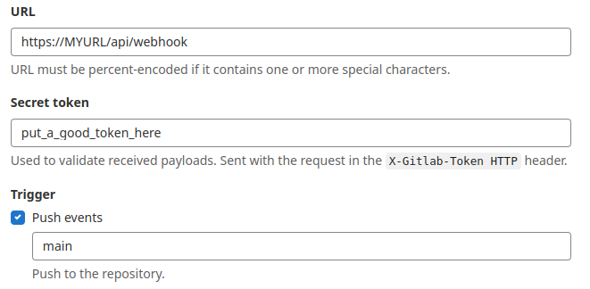
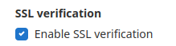

# Tune repository checks

Argocd by default checks the git repositories every 3 minutes to see if they are any changes. When you start to increase the number of applications and repositories, some argocd pods start to use a lot of cpu and memory resoruces.

With this settings we will make that process faster a lighter.

## From 3 minutes to 12 hours

First of all we will change increase the time argocd will do an automatic refresh.

This can be done with the following option in the argocd-cm configMap

```txt
timeout.reconciliation: 12h
```

## Faster and lighter: Gitlab side

Now we will argocd make a refresh when a push event is received in the git repository.

Lets see in Gitlab:

Go to your repository in Settings -  Webhooks and create a webhook with this options.

```txt
URL: https://YOUR_ARGOCD_INSTANCE_URL/api/webhook  (we need it exposed via ingress)
Secret Token: use a password generator to define a token
Trigger. Choose push events and configure the branch where your argocd manifests are located
SSL verification: If your argocd instace has a known certificate, let it enabled
```





## Faster and lighter: Argocd side

It is time to configure that token in our argocd instance. Create the following secret:

- In the argocd namespace
- Called, for example argocd-custom-secrets
- With the webhook.gitlab.secret key with the value of the token
- With the app.kubernetes.io/part-of: argocd label

Now will link the webhook.gitlab.secret with the recently created secret. This is done setting this line in the argocd-secret Secret

```yaml
apiVersion: v1
stringData:
  webhook.gitlab.secret: $argocd-custom-secrets:webhook.gitlab.secret
kind: Secret
metadata:
  name: argocd-secret
type: Opaque
```

> If you don't want to create a new secret, it is posibble to directly configure the value of the token in the webhook.gitlab.secret key of the argocd-secret Secret. I propose this way because of some problems merging an externalsecret with the existing argocd-secret Secret

## Test the web hook

We can go to the place where we created the webhook instance and test the webhook.


> It must have connectivity between gitlab and argocd

## Same for the applicationset controller

This settings refreshes the applications at every push, but we can do the same for the applicationsets

- Create a new ingress that exposes the webhook port of the argocd-applicationset-controller pod
- Create a new webhook in gitlab the same way, now with the url https://THE_NEW_INGRESS/api/webhook

> Sometimes it can be neccesary to restart the controller

```shell
kubectl rollout restart -n argocd deployment argocd-server
```

or

```shell
kubectl rollout restart -n argocd deploy argocd-applicationset-controller
```

## Increate performance via manifest-generate-paths

Another great setting is using manifest-generate-paths. We can tell argocd applications to only trigger a refresh is the changes are detected in one or more paths of the github repository.

This can be done adding the argocd.argoproj.io/manifest-generate-paths label to the applications

```txt
argocd.argoproj.io/manifest-generate-paths: .
```

This only will trigger a refresh when the changes are detected in the path the application has been declared. We can configure more paths comma separated.

> As I know, this only works for kustomize based applications

## Links

- Git Webhook Configuration

<https://argo-cd.readthedocs.io/en/stable/operator-manual/webhook/>

- High Availability
  
<https://argo-cd.readthedocs.io/en/stable/operator-manual/high_availability/>
