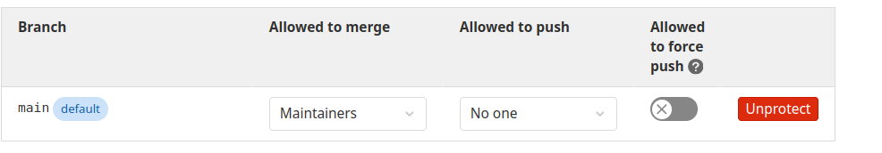
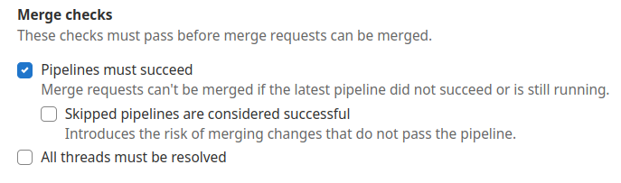

# Protect uploading secrets to main

## Protect the main branch

Go to Settings - Repository - Protected branches and configure that nobody can push to the main branch. In "Allowed to merge" leave the roles you permit to merge.



## Force pass the pipeline

Go to Settings - Merge requests - Merge requests and enable "Pipelines must succeed"



## Configure the pipeline to scan the pushes

Configure the pipeline to scan the merge requests in the .gitlab-ci.yml file

Example

```yaml
stages:
  - security
trufflehog-git:
  stage: security
  rules:
    - if: '$CI_PIPELINE_SOURCE == "merge_request_event"'
  image:
    name: docker.io/trufflesecurity/trufflehog:3.82.1
    entrypoint: ["/bin/sh", "-c"]
  script:
    - trufflehog --fail git "$CI_REPOSITORY_URL"
```

## Test

In order to test it, push a new branch with changes and do a merge request to main

## Links

- Merge request pipelines

<https://docs.gitlab.com/ee/ci/pipelines/merge_request_pipelines.html>

- CI_PIPELINE_SOURCE predefined variable

<https://docs.gitlab.com/ee/ci/jobs/job_rules.html#ci_pipeline_source-predefined-variable>
