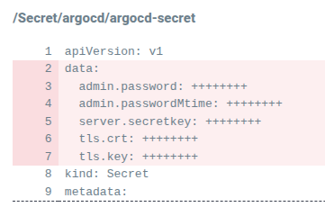

# argocd-secret via extenalsecret

## Intro

The argocd-secret kubernetes secret stores some information self managed by argocd like:

```txt
admin.password
admin.passwordMtime
server.secretkey
tls.crt
tls.key
```

It also supports other settings related with the webhooks token

```txt
webhook.github.secret: 
webhook.gitlab.secret: 
webhook.bitbucket.uuid: 
webhook.bitbucketserver.secret: 
webhook.gogs.secret: 
```

and also additional users/accounts related info

We can get that info with

```txt
kubectl get secret argocd-secret -o yaml --show-managed-fields
```

## The problem

The problem with this is that argocd is the owner of those fields. If we want to patch this content, mixing that selfmanaged fields with other controllers, like external-secrets-operator, we can get some unexpected results, like the deletion of the managed fields



If the deletion occurs, those fields can be recreated restarting the argocd-server server

```shell
kubectl rollout restart deployment argocd-server -n argocd
```

Also,the annotation argocd.argoproj.io/tracking-id can be change all the time between:

```txt
myapp:external-secrets.io/ExternalSecret:argocd/argocd-secret
myapp:/Secret:argocd/argocd-secret
```

Making the owner of that field different at every change

- argocd-controller
- externalsecrets.external-secrets.io/argocd-secret

## Solution 1: Via ExternalSecret

- argocd.argoproj.io/compare-options: IgnoreExtraneous

Because the owner changes all the time, this ignores that frequent out of sync only.

- argocd.argoproj.io/sync-options: Prune=false

- creationPolicy: Merge

The external secrets operator does not create the secret. It only merges the values with an existing secret

- deletionPolicy: Merge

If the secret is deleted from the provider, external secrets operator simply removes the keys from the secret, not the secret itself

```yaml
apiVersion: external-secrets.io/v1beta1
kind: ExternalSecret
metadata:
  name: argocd-secret
spec:
  data:
    - remoteRef:
        key: secret/argocd-webhook-token
      secretKey: webhook.github.secret
  target:
    creationPolicy: Merge
    deletionPolicy: Merge
    template:
      metadata:
        annotations:
          argocd.argoproj.io/sync-options: Prune=false
          argocd.argoproj.io/compare-options: IgnoreExtraneous
...
```

## Solution 2: Move our setting to another (external)secret

Argocd permits to put the value of a configmap or secret in our own custom secret. This permits to let external secrets operator to manage that external secret without touch the original one.

- Create our custom secret

 First we have to create an (external)secret with our value

> It must have the app.kubernetes.io/part-of: argocd label

```yaml
apiVersion: external-secrets.io/v1beta1
kind: ExternalSecret
metadata:
  name: argocd-custom-secret
spec:
  data:
    - remoteRef:
        key: secret/argocd-webhook-token 
      secretKey: webhook.github.secret
  target:
    template:
      metadata:
        labels:
          app.kubernetes.io/part-of: argocd
...
```

- Link the original place with the custom secret

Then we go to the original place where that value is configured an make a link to our new secret with the following format:

```txt
KEY: $CUSTOM-SECRET-NAME:KEY-IN-CUSTOM-SECRET
```

For example

```yaml
apiVersion: v1
kind: Secret
metadata:
  name: argocd-secret
type: Opaque
stringData:
webhook.github.secret: $argocd-custom-secret:webhook.github.secret
```

- Restart workload

Depending of what workload and setting is, we can probably need to restart the workload. For example

```shell
kubectl rollout restart deployment argocd-server -n argocd
```

### Notes

- This solution puts $argocd-custom-secret:webhook.github.secret as the value in the beginning. The restart changes it with the value in the custom secret.

- If we are doing the link with a kustomize patch and it is not applied, we must probably delete the secret first. This removes the self managed data including admin password and certificates, and the argocd needs to be restarted to recreate them
