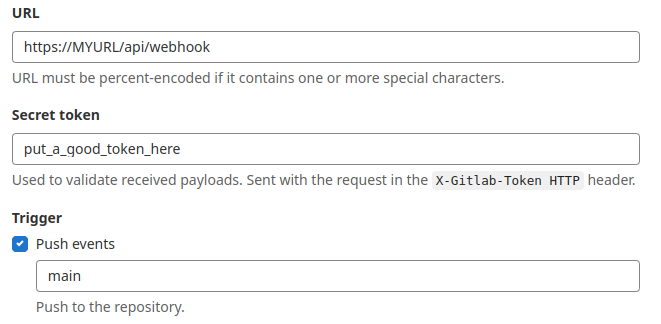

# Gitlab webhook

Now we will argocd make a refresh when a push event is received in the gitlab repository. This is very useful when increasing or disabling timeout.reconciliation

## Gitlab side

Go to your repository in Settings -  Webhooks and create a webhook with this options.

```txt
URL: https://YOUR_ARGOCD_INSTANCE_URL/api/webhook  (we need it exposed via ingress)
Secret Token: use a password generator to define a token
Trigger. Choose push events and configure the branch where your argocd manifests are located
SSL verification: If your argocd instace has a known certificate, let it enabled
```




## Argocd side (custom secret)

By defaut argocd-secret is used, but we will use a custom secret to store this setting.
If you don't want to create a new secret, it is posibble to directly configure the value of the token in the webhook.gitlab.secret key of the argocd-secret Secret. I propose this way because of some problems merging an externalsecret with the existing argocd-secret Secret

- Configure the argocd-secret to tell the webhook.gitlab.secret will be in another secret

```yaml
apiVersion: v1
stringData:
  webhook.gitlab.secret: $argocd-custom-secrets:webhook.gitlab.secret
kind: Secret
metadata:
  name: argocd-secret
type: Opaque
```

And the create a secret:

- called argocd-custom-secrets
- label it with **app.kubernetes.io/part-of: argocd**
- include the webhook.gitlab.secret key with the token

Now will link the webhook.gitlab.secret with the recently created secret. This is done setting this line in the argocd-secret Secret

Finally test the hook in the the place where we created the webhook instance with a push test


> It must have connectivity between gitlab and argocd

## Same for the Applicationset controller

We can do the same for the applicationsets, specially relevant if we:

- have increased the default 3m value of applicationsetcontroller.requeue.after setting in the argocd-cmd-params-cm ConfigMap
- make it at Applicationset level with requeueAfterSeconds

Steps

- Create a new ingress that exposes the webhook port of the argocd-applicationset-controller pod
- Create a new webhook in gitlab the same way, now with the url https://THE_NEW_INGRESS/api/webhook

## Links

- Git Webhook Configuration

<https://argo-cd.readthedocs.io/en/stable/operator-manual/webhook/>

- Git Generator

<https://argo-cd.readthedocs.io/en/stable/operator-manual/applicationset/Generators-Git/>
