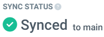
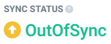

# Sync

Argocd in their documentation defines 2 states for an argocd application:

- The target state, as the desired state of the application.

We define this state via files in git repositories

- The live state

The real state is how the application is the kubernetes cluster

> Sync is the argocd process that applies the manifests in the cluster.

## Sync status

We have 3 possible sync statuses

- Synced

The target state and the live state are the same. Everything is ok.

- OutOfSync

There are differences between the target state and the live state. Sometimes a Sync is needed to move this state to Synced

- Unknown

There is a problem with the Sync process

## Sync process

The sync process or sync stage is the operation that applies the manifests of an application to the kubernetes cluster

It cant be executed:

- Using the web interface

- Using the argocd cli

<https://argo-cd.readthedocs.io/en/stable/user-guide/commands/argocd_app_sync/>

- Using kubectl

<https://argo-cd.readthedocs.io/en/stable/user-guide/sync-kubectl/>

- In an automated way

<https://argo-cd.readthedocs.io/en/stable/user-guide/auto_sync/>

> See the other links in this section for more information
