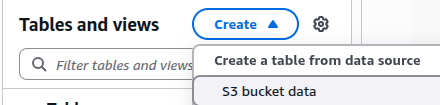

# AWS Billing

Cost and Usage Report (CUR) or Cost Explorer API

## Summary

Amazon Athena is a serverless, interactive query service that allows you to analyze data directly in Amazon S3 using standard SQL. We will do this:

- Export the billing data to a s3 bucket
- Configure Athena to analyze that information
- Configure Opencost to use that Athena settings

## Buckets

Create 2 s3 buckets

- One for the billing data
- Another required for Athena results

## Create data export

Using the AWS Console, go to Billing and Cost Management > Cost & Usage Analysis > Data exports and create an export

Choose the export name and the s3 bucket and prefix. Also:

```yaml
Type: Standard data export
Name: Choose one, for example opencost-myekscluster
Data table content settings: CUR 2.0
Additional export content: Check "Include resource IDs" # https://github.com/opencost/opencost/issues/3076
Time granularity: Hourly (recommended)
Compression type and file format: Parquet (optimized for Athena)
S3 bucket: Choose the s3bucket created for the billing data
S3 path prefix: Choose a prefix
```

> First export can take 24-48 hours to appear in S3. Wait for initial data generation exploring the s3 bucket some hours later.
>
## Configure Athena

Using the AWS Console, go to AWS Athena

### Workgroup

Create an Athena workgroup for opencost:

- Query result configuration: customer-managed
- Location of query result: associate the created bucket for athena queries

### Create database and table

Under athena query editor, select the workgroup opencost and create S3 Bucket data



```yaml
Table name: billing
Database configuration: Choose an existing database (our data created database)
Dataset: s3://MYEXPORTBUCKET/PATH_TO_DATA # the view button permits to check if the path is correct
Column details: import [this columns](table.txt) using bulk add columns
```

## Opencost

### Opencost Iam permissions

OpenCost supports four AWS authorizer types:

  1. AccessKey - Direct AWS access key and secret authentication
  2. ServiceAccount - Kubernetes service account with pod annotations
  3. AssumeRole - IAM role assumption using another authorizer
  4. WebIdentity - Web identity token authentication (supports Google as identity provider)

The Service Account authorizer leverages Kubernetes service account annotations and works with AWS pod identity mechanisms like:

- EKS Pod Identity
- IAM Roles for Service Accounts (IRSA)

A very open policy can be [this](policy.json)

## Opencost settings

- For Pod Identity Access
- Creating a secret called cloud-costs using externalsecrets operator. The target of the external-secret can be [this](eso-target.yaml)

## Opencost deployment

Configure opencost using helm chart for aws billing, choosing our secret

```yaml
opencost:
  cloudIntegrationSecret: "cloud-costs"
  cloudCost:
    enabled: true
  exporter: # this fixed a bug mounting the secret?
    extraVolumeMounts:
      - mountPath: "/var/configs"
        name: cloud-integration
```

## Links

- Installing on Amazon Web Services (AWS)

<https://opencost.io/docs/configuration/aws/>

- Creating reports

<https://docs.aws.amazon.com/cur/latest/userguide/cur-create.html>

- IAM

<https://github.com/opencost/opencost/issues/3056>
<https://github.com/opencost/opencost/issues/1217>
<https://github.com/opencost/opencost/issues/3204>
<https://github.com/opencost/opencost/issues/2869>

<https://medium.com/@prassonmishra330/cloud-cost-integration-aws-with-opencost-8b9557448e3a>
