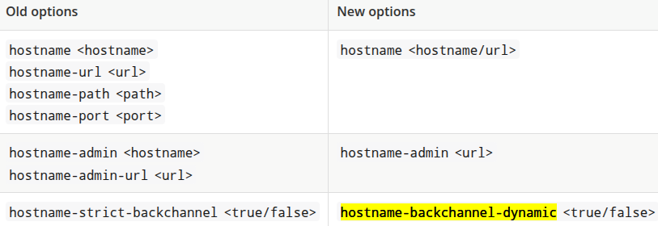

# Hostname v1 and v2 features

- Until the 25.0.0 release (jun 2024), the only way to configure the hostname is called the hostname-v1 feature.
- In this release, the default ways was the hostname:v2 feature. If you want to use the hostname-v1 feature instead of v2 feature, you must enable it. They are mutually exclusive.
- The hostname:v1 option was removed in 26.0.0

## Configure the hostname in hostname:v1

```txt
Using --hostname-url (KC_HOSTNAME_URL)

We can provide the full url with the --hostname-url parameter or the KC_HOSTNAME_URL environemnt variable using this format:

<scheme>://<host>:<port>/<path>

This setting is not supported directly in the keycloak operator
```

```txt
Using --hostname (KC_HOSTNAME) or spec.hostname.hostname in the operator

Here we provide only the hostname (my.domain.com).

Notes about the scheme


The scheme will be https unless you set --hostname-strict-https=false (KC_HOSTNAME_STRICT_HTTPS). This is an undocumented setting
This setting is not supported directly in the keycloak operator
```

Notes about the port

```txt
--hostname-port parameter (KC_HOSTNAME_PORT) defines the port number that the Keycloak server is listening on for HTTP or HTTPS traffic. 
This setting is not supported directly in the keycloak operator
```

Notes about the path

```txt
We can provide --hostname-path (KC_HOSTNAME_PATH) to specify the context path or path prefix for the Keycloak server. This option affects where Keycloak is accessible and how URLs are generated, particularly when deployed behind a reverse proxy. 
Example: If a reverse proxy forwards requests to /keycloak on your Keycloak server, you might set KC_HOSTNAME_PATH=/keycloak to ensure Keycloak's URLs are also prefixed with /keycloak.

The hostname-path also affects the admin console URL. If you set hostname-path=/keycloak, the admin console will be accessible at your-domain.com/keycloak/admin.
In some cases, you might use http-relative-path instead of hostname-path, which specifies the relative path of the HTTP backend without affecting the full hostname.
This setting is not supported directly in the keycloak operator
```

## hostname-v1 backend

In hostname-v1, by default, the URLs for backend endpoints are also based on the incoming request.
We can change this behaviour with the hostname-strict-backchannel (KC_HOSTNAME_STRICT_BACKCHANNEL). Here the URLs for the backend endpoints are going to be exactly the same as the frontend endpoints.

When all applications connected to Keycloak communicate through the public URL, set hostname-strict-backchannel to true. Otherwise, leave this parameter as false (default) to allow client-server communication through a private network.

## hostname-v1 admin console

In hostname-v1, by default, the URLs for administration console are also based on the incoming request. We can restrict access to the administration console using a specific URL using:

```txt
a host

- parameter: --hostname-admin
- environment variable: KC_HOSTNAME_ADMIN
- operator: spec.hostname.admin

or the full url with

- parameter: --hostname-admin-url
- environment variable: KC_HOSTNAME_ADMIN_URL
- operator: spec.hostname.adminUrl
```

## Changed settings

These are how the settings changed from v1 to v2



## Links

- Configuring the hostname: (v1) Redhat

<https://docs.redhat.com/en/documentation/red_hat_build_of_keycloak/24.0/html/server_guide/hostname->

- Configuring the hostname (v2)  

<https://www.keycloak.org/server/hostname>

- Upgrade to 25.0.0  

<https://www.keycloak.org/docs/25.0.0/upgrading/>

- Keycloak 26.0.0 released

<https://www.keycloak.org/2024/10/keycloak-2600-released>

- Migrating to 25.0.0

<https://www.keycloak.org/docs/latest/upgrading/#migrating-to-25-0-0>

- All configuration

<https://www.keycloak.org/server/all-config>
