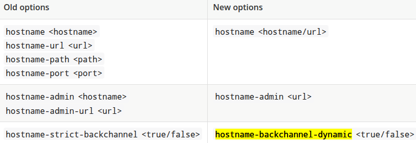

# Endpoints

Keycloak exposes different endpoint groups that can be categorized into three main groups:

- Frontend
- Backend
- Administration Console

In every endpoint we can configure a base url that contains:

- scheme (https, http,..)
- hostname fqdn (my.domain.com)
- port (8443, 80,..)
- path (/auth, ...)

The base URL for each group has an important impact on:

- how tokens are issued and validated
- how links are created for actions that require the user to be redirected to Keycloak
- how applications will discover these endpoints when fetching the OpenID Connect Discovery Document from realms/{realm-name}/.well-known/openid-configuration.

## Frontend endpoints

In production mode the most important setting is the hostname and there are 2 ways to configure it

### hostname-v1 feature

The old way (v1) was the only option until the 25.0.0 release (jun 2024). In this release, if you want to use it instead of the hostname:v2 feature, you must enable the hostname-v1 feature. They are mutually exclusive.

> The hostname v1 option was removed in 26.0.0

- Using --hostname-url (KC_HOSTNAME_URL)

We can provide the full url with the --hostname-url parameter or the KC_HOSTNAME_URL environemnt variable using this format:

```txt
<scheme>://<host>:<port>/<path>
```

This setting is not supported directly in the keycloak operator

- Using --hostname (KC_HOSTNAME) or spec.hostname.hostname in the operator

Here we provide only the hostname (my.domain.com).

Notes about the scheme

```txt
The scheme will be https unless you set --hostname-strict-https=false (KC_HOSTNAME_STRICT_HTTPS). This is an undocumented setting
This setting is not supported directly in the keycloak operator
```

Notes about the port

```txt
--hostname-port parameter (KC_HOSTNAME_PORT) defines the port number that the Keycloak server is listening on for HTTP or HTTPS traffic. 
This setting is not supported directly in the keycloak operator
```

Notes about the path

```txt
We can provide --hostname-path (KC_HOSTNAME_PATH) to specify the context path or path prefix for the Keycloak server. This option affects where Keycloak is accessible and how URLs are generated, particularly when deployed behind a reverse proxy. 
Example: If a reverse proxy forwards requests to /keycloak on your Keycloak server, you might set KC_HOSTNAME_PATH=/keycloak to ensure Keycloak's URLs are also prefixed with /keycloak.

The hostname-path also affects the admin console URL. If you set hostname-path=/keycloak, the admin console will be accessible at your-domain.com/keycloak/admin.
In some cases, you might use http-relative-path instead of hostname-path, which specifies the relative path of the HTTP backend without affecting the full hostname.
This setting is not supported directly in the keycloak operator
```

### hostname:v2 feature

The hostname v2 was available as the default option in the 25.0.0 release (jun 2024) and it is the only available in the 26.0.0 release.
This configuration option was created in order to simplify the hostname configuration settings

Using --hostname (KC_HOSTNAME) or spec.hostname.hostname in the operator we can configure the rul url or just the hostname. When only hostname is provided, scheme, port and context path are resolved from the request.

### Shared options

- hostname-strict (KC_HOSTNAME_STRICT) by default disables dynamically resolving the hostname from request headers. With false as value, enables the dinamic resolution
  hostname-debug (KC_HOSTNAME_DEBUG) toggles the hostname debug page that is accessible at /realms/master/hostname-debug.

## Backend endpoints

### hostname-v1 backend

In hostname-v1, by default, the URLs for backend endpoints are also based on the incoming request.
We can change this behaviour with the hostname-strict-backchannel (KC_HOSTNAME_STRICT_BACKCHANNEL). Here the URLs for the backend endpoints are going to be exactly the same as the frontend endpoints.

When all applications connected to Keycloak communicate through the public URL, set hostname-strict-backchannel to true. Otherwise, leave this parameter as false (default) to allow client-server communication through a private network.

### hostname-v2 backend

Here there is another setting called hostname-backchannel-dynamic (KC_HOSTNAME_BACKCHANNEL_DYNAMIC). It enables dynamic resolving of backchannel URLs, including hostname, scheme, port and context path.

The default value is false. Set to true if your application accesses Keycloak via a private network. If set to true, hostname option needs to be specified as a full URL.

## Admin console

The server exposes the administration console and static resources using a specific URL.

### hostname-v1 admin console

In hostname-v1, by default, the URLs for administration console are also based on the incoming request. We can restrict access to the administration console using a specific URL using:

```txt
a host

- parameter: --hostname-admin
- environment variable: KC_HOSTNAME_ADMIN
- operator: spec.hostname.admin

or the full url with

- parameter: --hostname-admin-url
- environment variable: KC_HOSTNAME_ADMIN_URL
- operator: spec.hostname.adminUrl
```

### hostname-v2 admin console

Here only hostname-admin is available and only supports a full URL. Use this option if you are exposing the administration console using a reverse proxy on a different address than specified in the hostname option.

> The administration endpoints for Red Hat build of Keycloak and the Admin Console should not be publicly accessible. Therefore, you can secure them by using a reverse proxy.

### Changed settings



## Links

- Configuring the hostname: (v1)

<https://docs.redhat.com/en/documentation/red_hat_build_of_keycloak/24.0/html/server_guide/hostname->

- Configuring the hostname (v2)  

<https://www.keycloak.org/server/hostname>

- Upgrade to 25.0.0  

<https://www.keycloak.org/docs/25.0.0/upgrading/>

- Using a reverse proxy  
<https://www.keycloak.org/server/reverseproxy>

- Keycloak 26.0.0 released

<https://www.keycloak.org/2024/10/keycloak-2600-released>

- Migrating to 25.0.0

<https://www.keycloak.org/docs/latest/upgrading/#migrating-to-25-0-0>

- All configuration

<https://www.keycloak.org/server/all-config>

- Admin console not loading and hostname related issues #14666  

<https://github.com/keycloak/keycloak/issues/14666>
