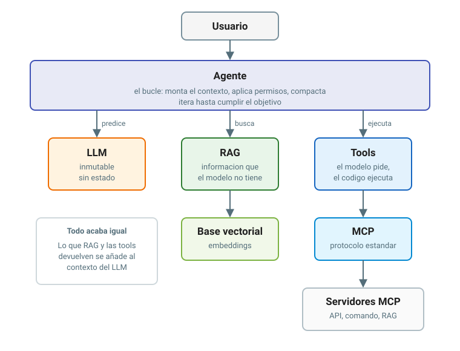

# Conceptos

Las piezas basicas y como encajan.

## LLM

El motor. Recibe un contexto y predice la salida, token a token. Es inmutable y
no tiene memoria: cada peticion empieza de cero.

Todo lo demas existe por sus dos limitaciones: no conoce datos nuevos ni privados,
y no puede ejecutar nada.

[Ver mas](01-llm.md)

## Inferencia

Usar el modelo. La peticion lleva el contexto como lista de mensajes con rol, y se
factura por tokens de entrada y de salida.

[Ver mas](02-inferencia.md)

## RAG

Busca informacion en fuentes externas y la mete en el contexto antes de preguntar.
Cubre lo que el modelo no sabe.

No modifica el modelo, solo enriquece el contexto.

[Ver mas](03-rag.md)

## Tools y MCP

Una tool es una funcion que el modelo puede pedir que se ejecute. El modelo no
ejecuta nada: solo pide, y otro programa ejecuta.

MCP es el protocolo estandar para exponer esas tools y reutilizarlas entre
clientes distintos.

[Tools](04-tools.md) | [MCP](05-mcp.md)

## Agente

El bucle que junta todo lo anterior: llama al LLM, ejecuta las tools que pide,
añade el resultado al contexto y vuelve a empezar hasta cumplir el objetivo.

[Ver mas](06-agente.md)
